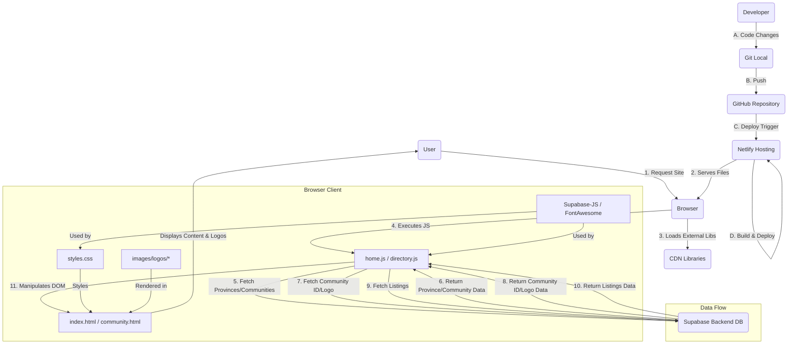

```mermaid
graph TD
    %% Define Main Actors/Services
    User(User)
    Developer(Developer)
    Browser(Browser)
    Netlify(Netlify Hosting)
    GitHub(GitHub Repository)
    Git(Git Local)
    Supabase(Supabase Backend DB)
    CDN(CDN Libraries)

    %% Define Components within Browser
    subgraph Browser Client
        HTML[index.html / community.html]
        CSS[styles.css]
        JS[home.js / directory.js]
        Logos[images/logos/*]
        Libs[Supabase-JS / FontAwesome]
    end

    %% Define Interactions
    User -- 1. Request Site --> Browser;
    Developer -- A. Code Changes --> Git;
    Git -- B. Push --> GitHub;
    GitHub -- C. Deploy Trigger --> Netlify;
    Netlify -- D. Build & Deploy --> Netlify;
    Netlify -- 2. Serves Files --> Browser;
    Browser -- 3. Loads External Libs --> CDN;
    Browser -- 4. Executes JS --> JS;

    subgraph Data Flow
      JS -- 5. Fetch Provinces/Communities --> Supabase;
      JS -- 7. Fetch Community ID/Logo --> Supabase;
      JS -- 9. Fetch Listings --> Supabase;
      Supabase -- 6. Return Province/Community Data --> JS;
      Supabase -- 8. Return Community ID/Logo Data --> JS;
      Supabase -- 10. Return Listings Data --> JS;
    end

    JS -- 11. Manipulates DOM --> HTML;
    CSS -- Styles --> HTML;
    HTML -- Displays Content & Logos --> User;
    Logos -- Rendered in --> HTML;
    Libs -- Used by --> JS;
    Libs -- Used by --> CSS;
```